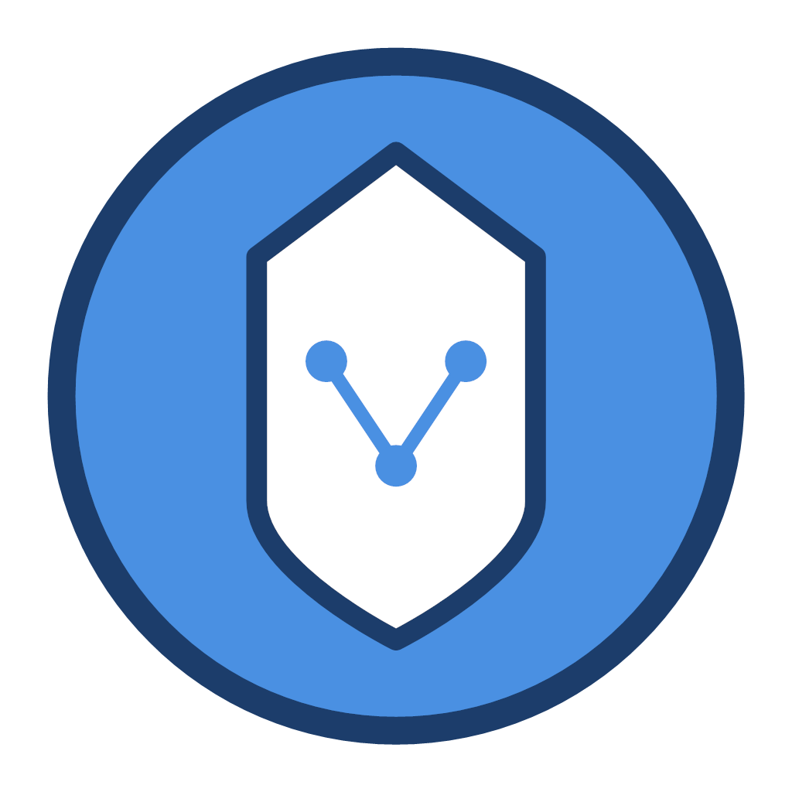

<p align="center">
  
</p>

<h1 align="center">FlowLens</h1>

<p align="center">
  A local-first desktop MITM traffic inspector for HTTP, HTTPS, WebSocket, and SOCKS5 workflows.
</p>

<p align="center">
  <a href="https://github.com/josexy/flowlens/actions/workflows/ci.yml"></a>
  <a href="https://github.com/josexy/flowlens/releases/latest"></a>
  <a href="LICENSE"></a>
</p>

FlowLens helps developers capture local proxy traffic, trace requests back to desktop processes, inspect precise timing and transfer sizes, replay or edit requests, export HAR files, and keep useful sessions in local history. It is built with Wails v3, Go, Vue 3, TypeScript, Nuxt UI, and Tailwind CSS.

> [!IMPORTANT]
> FlowLens is currently beta. Internal contracts and local development data may change without compatibility migration before a stable release.

## Highlights

- HTTP/HTTPS MITM capture and SOCKS5 proxy mode
- Live SSE bodies and WebSocket messages
- Ordered request/response headers and response trailers with duplicate, casing, and empty-value preservation
- Microsecond transport timing, terminal states, logical header sizes, and encoded Body sizes
- HTTP Request Editor, WebSocket Client, request resend, proxy selection, uTLS profiles, and HTTP/2 fingerprints
- API Collections with folders, managed request bodies, and reusable protocol/fingerprint settings
- Optional global and current-request Python 3.11+ hooks with a correlated live console
- Current-capture and history HAR 1.2 export with streamed atomic writes
- Windows, macOS, and Linux process attribution with application icons and metadata
- Local history, categorization, runtime logs, storage controls, certificates, shortcuts, themes, and bilingual UI

## Install

Download the latest build from [GitHub Releases](https://github.com/josexy/flowlens/releases/latest).

| Platform | Packages |
| --- | --- |
| Windows x64 | NSIS installer or portable ZIP |
| macOS | Apple Silicon DMG or universal DMG |
| Linux x64 | AppImage, Debian package, or RPM package |

Each release includes `SHA256SUMS.txt`. Packages may be unsigned when platform signing credentials were unavailable, so Windows or macOS can display an operating-system warning. Signed Linux releases include detached signatures and the matching public key; check the release notes before installing.

## Quick Start from Source

### Requirements

- Go 1.27 or newer
- Node.js 20.19+ or 22.12+
- npm
- Wails v3 CLI (`wails3`)
- Task CLI (`task`), recommended

Python 3.11+ is optional and required only for Python request hooks. Platform packaging can additionally require NSIS, Xcode command-line tools/signing credentials, Docker, or native Linux packaging dependencies.

### Run the Desktop App

```shell
git clone https://github.com/josexy/flowlens.git
cd flowlens/frontend
npm install
cd ..
wails3 generate bindings -ts -i
task dev
```

If Task is unavailable, start Wails directly:

```shell
wails3 dev -config ./build/config.yml
```

The embedded frontend dev server uses port `9245` by default. Override it with `WAILS_VITE_PORT`. FlowLens UI development requires the Wails desktop window; opening the Vite page directly does not provide the Go backend.

## Documentation

- [User Guide](docs/user-guide.md) — request editing, shortcuts, system proxy, HAR, process attribution, logs, storage, and certificates
- [Python Plugin Guide](docs/technical/python-plugins.md) · [简体中文](docs/technical/python-plugins.zh-CN.md)
- [Python Plugin Examples](docs/examples/python-plugins)
- [Platform Build and Packaging](build/README.md)
- [Contributing Guide](CONTRIBUTING.md)
- [Security Policy](SECURITY.md)

## Development

Common commands run from the repository root unless noted otherwise.

| Command | Purpose |
| --- | --- |
| `task dev` | Start the Wails development app |
| `task build` | Build for the current platform |
| `task package` | Package for the current platform |
| `task run` | Run the built binary |
| `go test ./...` | Run backend tests |
| `wails3 generate bindings -ts -i` | Regenerate TypeScript bindings after exported API/model changes |
| `task version VERSION=1.2.3` | Synchronize release version metadata |
| `task version VERSION=1.2.3 CHECK=true` | Check release version metadata without writing |

Frontend checks:

```shell
cd frontend
npm run type-check
npm run lint
npm run test:process-icon-cache
npm run test:request-editor-state
npm run test:traffic-utils
npm run lint:tailwind
npm run build
```

When `build/config.yml` file associations or application metadata change, refresh generated build assets with:

```shell
wails3 task common:update:build-assets
```

## Data and Security

FlowLens stores its SQLite database, API Collection files, history, logs, certificates, and caches under the operating-system user configuration directory. The exact paths and cleanup behavior are documented in the [User Guide](docs/user-guide.md#settings-and-local-storage).

- Use FlowLens only for traffic you own or are authorized to inspect.
- Listening on `ALL` (`0.0.0.0`) exposes the proxy to reachable devices.
- Keep the generated MITM CA private key private and remove the CA from trust stores when it is no longer needed.
- Captures, history, HAR files, API Collections, logs, cached bodies, and process metadata may contain credentials or other sensitive data.
- Python plugins execute as trusted local code; interpreter isolation is not a security sandbox.
- An abnormal shutdown can prevent managed system-proxy restoration. See [Managed System Proxy](docs/user-guide.md#managed-system-proxy) for recovery details.

Report vulnerabilities through [SECURITY.md](SECURITY.md), not a public issue.

## Contributing and Support

Read [CONTRIBUTING.md](CONTRIBUTING.md) before proposing code or documentation changes. Use [GitHub Issues](https://github.com/josexy/flowlens/issues) for reproducible bugs and focused feature requests, and remove credentials, captured traffic, private paths, certificates, and logs before posting.

## License

FlowLens is licensed under the terms in [LICENSE](LICENSE).
