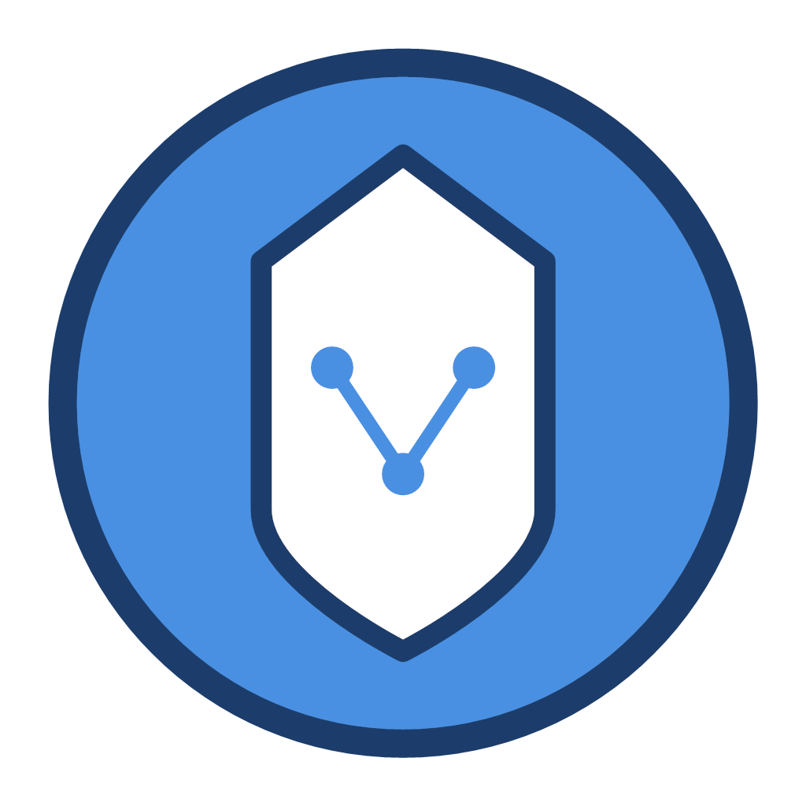
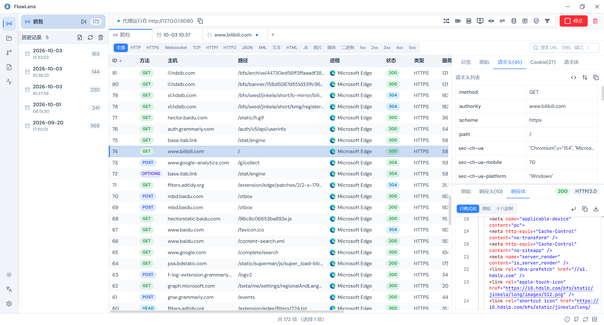
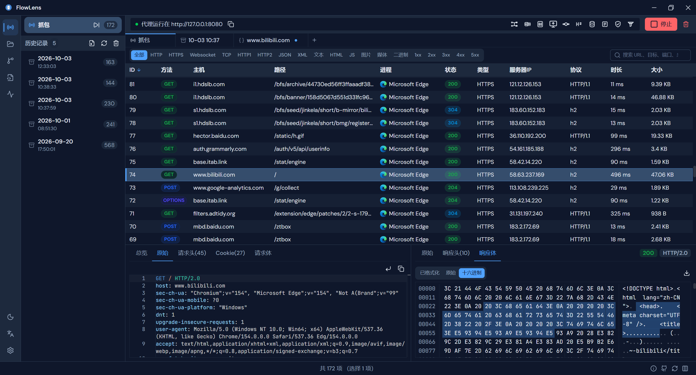

<p align="center">
  
</p>

<h1 align="center">FlowLens</h1>

<p align="center">
  A local-first desktop MITM traffic inspector for HTTP, HTTPS, WebSocket, and SOCKS5 workflows.
</p>

<p align="center">
  <a href="https://github.com/josexy/flowlens/actions/workflows/ci.yml"></a>
  <a href="https://github.com/josexy/flowlens/releases/latest"></a>
  <a href="LICENSE"></a>
</p>

FlowLens captures proxy traffic, identifies local processes, and lets you inspect, edit, replay, and save requests. Built with Wails v3, Go, Vue 3, TypeScript, Nuxt UI, and Tailwind CSS.

> [!IMPORTANT]
> FlowLens is currently beta. Internal contracts and local development data may change without compatibility migration before a stable release.

## Screenshots

### Light Theme



### Dark Theme



## Highlights

- HTTP/HTTPS MITM capture, SOCKS5 proxying, live SSE message lists with per-message inspection, and WebSocket messages
- Ordered headers/trailers, microsecond timing, transfer sizes, and text, image, and hex body views
- Request editing/resend, WebSocket Client, proxy selection, uTLS profiles, and HTTP/2 fingerprints
- Live HTTP(S) rewrite rules: redirects, header/query edits, and UTF-8 body replacement
- API Collections, local history, categorization, and optional Python 3.11+ request hooks with a live console
- HAR import by file picker or drag-and-drop; capture/history export to CSV and HAR
- Traffic-row export of requests, responses, headers, bodies, and combined exchanges
- Process attribution and icons on Windows, macOS, and Linux; managed system proxy and current-user CA trust controls on Windows/macOS
- App update checks, shortcuts, customizable theme colors and font sizes, persistent detail layout, and Chinese/English UI

## Install

Download the latest build from [GitHub Releases](https://github.com/josexy/flowlens/releases/latest).

| Platform | Packages |
| --- | --- |
| Windows x64 | NSIS installer or portable ZIP |
| macOS | Apple Silicon DMG or universal DMG |
| Linux x64 | AppImage, Debian package, or RPM package |

Verify downloads with `SHA256SUMS.txt`. Unsigned Windows/macOS packages may trigger operating-system warnings; signed Linux releases include detached signatures and a public key.

Use the status-bar update control to check releases. Eligible Windows/macOS installations can download, verify, and apply updates after restart; Linux, Windows installs under Program Files, and apps running from a mounted macOS DMG require manual updates.

Start the proxy and configure your client to use `127.0.0.1:8080` by default. For HTTPS, generate and trust the CA in Settings; Windows/macOS offer a current-user install/uninstall control. See the [User Guide](docs/user-guide.md) for setup details.

## Quick Start from Source

### Requirements

- Go 1.27 or newer
- Node.js 24 LTS (24.21+; the version used by CI is pinned in `.node-version`)
- npm (bundled with Node.js), Wails v3 CLI (`wails3`), and preferably Task (`task`)

Python 3.11+ is needed only for Python request hooks; FlowLens detects existing interpreters but does not install them. See the [Python setup guide](docs/technical/python-plugins.md#set-up-python) and [platform build requirements](build/README.md).

### Run the Desktop App

```shell
git clone https://github.com/josexy/flowlens.git
cd flowlens/frontend
npm install
cd ..
wails3 generate bindings -ts -i
task dev
```

If Task is unavailable, start Wails directly:

```shell
wails3 dev -config ./build/config.yml
```

The embedded frontend dev server uses port `9245` by default. Override it with `WAILS_VITE_PORT`. FlowLens UI development requires the Wails desktop window; opening the Vite page directly does not provide the Go backend.

## Documentation

- [User Guide](docs/user-guide.md) — request editing, rewrite rules, shortcuts, system proxy, HAR, process attribution, logs, storage, and certificates
- [HTTP Rewrite Rules](docs/technical/http-rewrite-rules.md) — execution, limits, and lifecycle
- [Python Plugin Guide](docs/technical/python-plugins.md) · [简体中文](docs/technical/python-plugins.zh-CN.md)
- [Python Plugin Examples](docs/examples/python-plugins)
- [Platform Build and Packaging](build/README.md)
- [Contributing Guide](CONTRIBUTING.md)
- [Engineering Guidelines](AGENTS.md)
- [Security Policy](SECURITY.md)

## Development

Common commands run from the repository root unless noted otherwise.

| Command | Purpose |
| --- | --- |
| `task build` / `task package` / `task run` | Build, package, or run for the current platform |
| `go test ./...` | Run backend tests |
| `task lint:go` | Check Go lint and formatting |
| `wails3 generate bindings -ts -i` | Regenerate TypeScript bindings after exported API/model changes |
| `task version VERSION=1.2.3` | Synchronize release version metadata |
| `task version VERSION=1.2.3 CHECK=true` | Check release version metadata without writing |

Frontend checks:

```shell
cd frontend
npm run type-check
npm run lint
npm run lint:tailwind
npm run build
```

Run the relevant `test:*` scripts from [frontend/package.json](frontend/package.json); scope-specific checks are listed in [AGENTS.md](AGENTS.md#verification). After changing metadata or file associations in `build/config.yml`, run `wails3 task common:update:build-assets`.

## Data and Security

Local data is stored under the operating-system user configuration directory. See [storage and cleanup](docs/user-guide.md#settings-and-local-storage) for paths and retention behavior.

- Use FlowLens only for traffic you own or are authorized to inspect.
- Listening on `ALL` (`0.0.0.0`) exposes the proxy to reachable devices.
- Keep the generated MITM CA private key private and remove the CA from trust stores when it is no longer needed.
- Captures, exports, history, API Collections, logs, caches, and process metadata may contain sensitive data; exports are not automatically redacted.
- Python plugins execute as trusted local code; interpreter isolation is not a security sandbox.
- An abnormal shutdown can prevent managed system-proxy restoration. See [Managed System Proxy](docs/user-guide.md#managed-system-proxy) for recovery details.

Report vulnerabilities through [SECURITY.md](SECURITY.md), not a public issue.

## Contributing and Support

Read [CONTRIBUTING.md](CONTRIBUTING.md) before proposing code or documentation changes. Use [GitHub Issues](https://github.com/josexy/flowlens/issues) for reproducible bugs and focused feature requests, and remove credentials, captured traffic, private paths, certificates, and logs before posting.

## License

FlowLens is licensed under the terms in [LICENSE](LICENSE).
